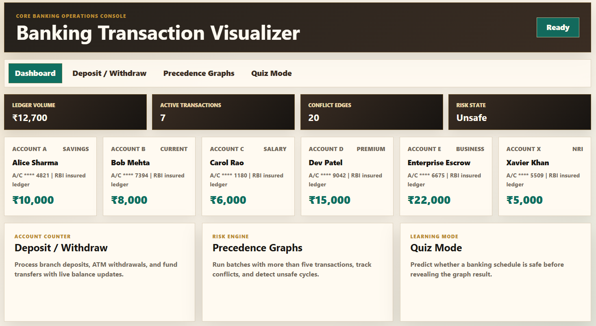
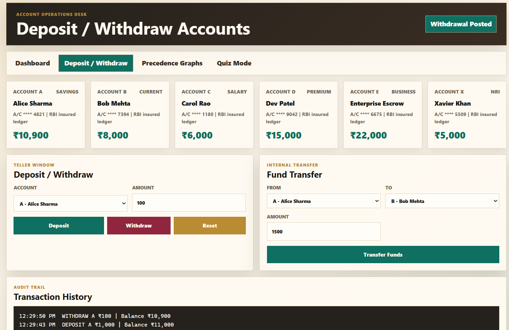
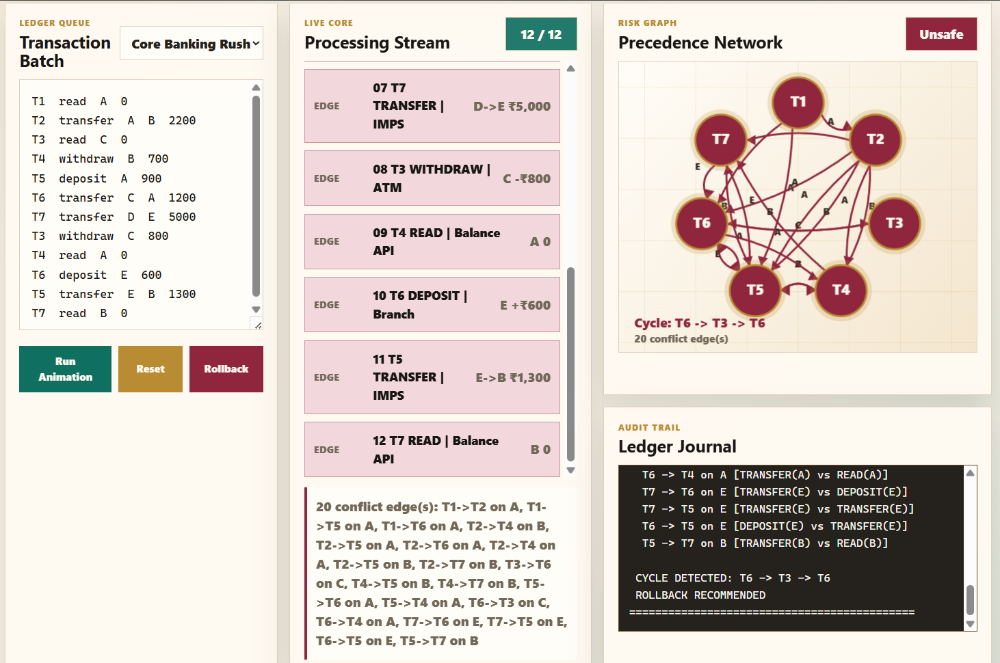
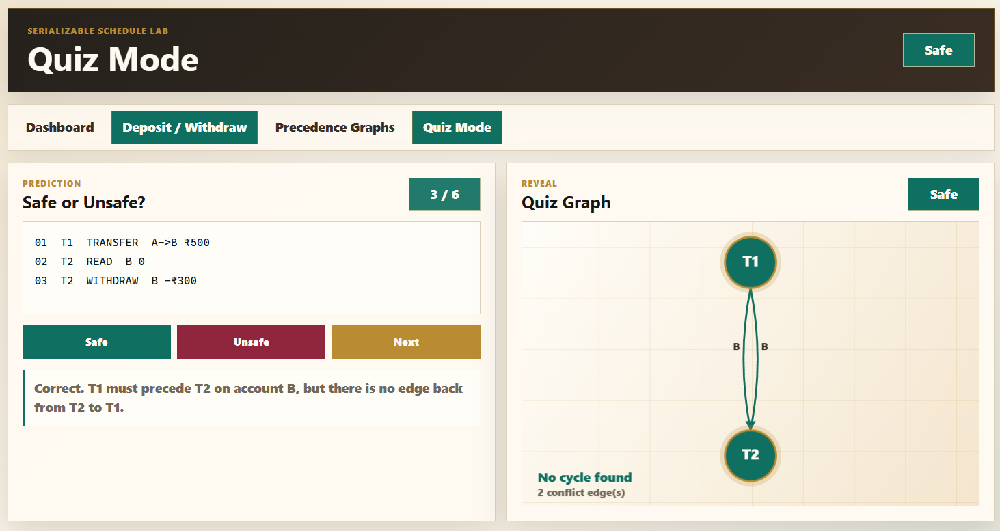

# Banking Transaction Visualizer



A Python mini-project that simulates concurrent banking transactions, detects conflicts, builds a precedence graph, and runs DFS cycle detection.

---

## Quick Start

### Browser frontend

Open this file in your browser:

```text
frontend/index.html
```

The browser version uses HTML, CSS, and JavaScript with separate dashboard pages:

- `frontend/index.html` - overview dashboard
- `frontend/accounts.html` - deposit, withdraw, and transfer accounts
- `frontend/graph.html` - precedence graphs, live tracking, conflicts, and rollback
- `frontend/quiz.html` - safe/unsafe schedule quiz mode

Supported browser operations:

```text
T1  read      A      0
T2  deposit   A      1000
T3  withdraw  B      500
T4  transfer  A      B      1500
```

### 1. Install dependencies

```bash
pip install networkx matplotlib
```

Tkinter is bundled with Python. If it's missing on Linux:

```bash
sudo apt install python3-tk   # Debian/Ubuntu
```

### 2. Run the app

```bash
cd BankingTransactionVisualizer
python main.py
```

---

## Project Structure

```
BankingTransactionVisualizer/
├── main.py              # GUI — entry point
├── accounts.py          # Account class (deposit/withdraw/rollback)
├── transactions.py      # Transaction class + schedule builder
├── conflict_detector.py # Detects read-write / write-write conflicts
├── graph_generator.py   # Builds & draws the precedence graph
├── cycle_detection.py   # DFS cycle detection
├── rollback.py          # Checkpoint + rollback manager
├── scheduler.py         # Executes a schedule against accounts
└── README.md
```

---

## Tabs

| Tab | What it does |
|-----|-------------|
| **Accounts** | View balances, deposit/withdraw manually, reset |
| **Scheduler** | Enter or pick a preset schedule, run it, see logs |
| **Graph / DFS** | View the auto-generated precedence graph after running |
| **Quiz Mode** | Guess Safe/Unsafe → graph revealed after answer |

---

## How a Schedule Works

Each line in the Scheduler editor is one operation:

```
T1  read   A   0
T2  write  A  -500
T1  write  B  2000
```

| Column | Values |
|--------|--------|
| TID | T1, T2, T3, … |
| OP | `read` or `write` in Tkinter; `read`, `deposit`, `withdraw`, or `transfer` in the browser frontend |
| ACCOUNT | A, B, C, X |
| AMOUNT | +deposit / −withdraw / 0 for read |

---

## Preset Schedules

- **Safe Schedule** — T1 and T2 on different accounts, no conflict
- **Unsafe — Write-Write** — both transactions write to A → cycle
- **Unsafe — Cycle T1↔T2** — T1 reads A then T2 writes A; T2 reads B then T1 writes B
- **3-Transaction Safe** — linear chain, no cycle

---

## Key Concepts

### Conflict
Two operations from different transactions on the **same account** where **at least one is a WRITE**.

### Precedence Graph
An edge `Ti → Tj` means Ti must execute before Tj.

### DFS Cycle Detection
If the precedence graph has a cycle, the schedule is **serializable-unsafe** → rollback.

---

## Requirements

- Python 3.8+
- networkx
- matplotlib
- tkinter (standard library)

--- 
## Dashboard


## Deposit & Withdraw



## Transaction Scheduler



## Quiz Mode

